# Mitek GTM Toolkit

**One revenue engine, two owners.** A working toolkit built against Mitek Systems' two open GTM roles. It shows how I'd run the lead side (GTM Engineer) and the pipeline-to-renewal side (GTM Strategy & Operations Manager), and the shared foundation both depend on.


> All accounts, people and numbers in `sample_data/` are synthetic. Mitek company facts come from public sources and are cited in the [company brief](shared_core/context/mitek-company-brief.md). Working assumptions are tagged `[ASSUME]` in [`config/mitek.yaml`](config/mitek.yaml).

---

## How to read this repo

Every folder, badge and diagram node is colour-coded by the role it supports:

| Colour | Folder | Supports | Owns the revenue lifecycle from… |
|---|---|---|---|
| 🟦 **Blue** | [`gtm_engineer/`](gtm_engineer/) | [GTM Engineer posting](https://jobs.lever.co/miteksystems-2/45e6c07b-c64d-4bc1-93dd-caf9e7b649ed) | first signal → enrichment → score → route → AI research → SQL |
| 🟩 **Green** | [`gtm_strategy_ops/`](gtm_strategy_ops/) | [GTM Strategy & Ops posting](https://jobs.lever.co/miteksystems-2/158d6add-b1b5-4de6-aaa4-5975e241766d) | opportunity → stage gates → deal risk → forecast → close → renewal |
| 🟪 **Purple** | [`shared_core/`](shared_core/) | **Both** | Salesforce data model, data quality, AI governance, metric definitions, Mitek context |

**Start here:** the [wiki](https://github.com/peytonbackus-spec/mitek-gtm-toolkit/wiki). Then [`ROLE_MAP.md`](ROLE_MAP.md) lists every requirement in both postings side by side, each linked to the artifact that answers it.

```mermaid
flowchart LR
    subgraph ENG["🟦 GTM Engineer"]
        direction LR
        S[Signals<br/>Qualified · Clay · Sales Nav] --> E[Enrich<br/>Clay + Lusha] --> SC[Score<br/>Fit × Intent] --> RT[Route<br/>R1–R7] --> AI1[AI research<br/>brief] --> CD[Cadence<br/>Salesloft + Nooks]
    end
    subgraph OPS["🟩 GTM Strategy & Ops"]
        direction LR
        O[Opportunity<br/>stage gates] --> DR[Deal risk<br/>+ AI commentary] --> FC[Clari forecast<br/>+ accuracy] --> CW[Close] --> RN[Renewal health<br/>+ AI brief]
        RN -->|expansion| O
    end
    subgraph SH["🟪 Shared Core"]
        direction LR
        DM[(Salesforce<br/>data model)] --- DQ[Data-quality<br/>monitor] --- GOV[AI governance<br/>PII · evals · HITL] --- MET[Metric<br/>definitions + SQL]
    end
    CD --> H{{Lead → Opportunity<br/>handoff}} --> O
    SH -.-> ENG
    SH -.-> OPS
    classDef eng fill:#1F6FEB1A,stroke:#1F6FEB,color:#1F6FEB;
    classDef ops fill:#2DA44E1A,stroke:#2DA44E,color:#2DA44E;
    classDef sh fill:#7B61FF1A,stroke:#7B61FF,color:#7B61FF;
    class S,E,SC,RT,AI1,CD eng;
    class O,DR,FC,CW,RN ops;
    class DM,DQ,GOV,MET sh;
```



## The two roles at a glance

| | 🟦 GTM Engineer | 🟩 GTM Strategy & Ops Manager |
|---|---|---|
| **Core question** | Are we creating enough *qualified* pipeline, efficiently? | Will we hit the number, and keep what we've won? |
| **Primary objects** | Lead, Campaign, Account (matching) | Opportunity, Forecast, Renewal |
| **AI workflows** | Account research, enrichment, qualification, routing | Deal-risk detection, forecast commentary, renewal signals |
| **Key systems** | Clay, Lusha, Qualified, Salesloft, Nooks, Sales Navigator | Clari, Clari Copilot |
| **Shared systems** | Salesforce · warehouse/BI · AI governance | Salesforce · warehouse/BI · AI governance |
| **Headline metrics** | Lead→opp conversion, speed-to-lead, pipeline per lead, scoring lift | Coverage, forecast accuracy and bias, win rate, GRR/NRR |
| **Partners with** | Marketing, SDR leadership, AEs | Sales leadership, Finance, Customer Success |
| **Track overview** | [`gtm_engineer/README.md`](gtm_engineer/README.md) | [`gtm_strategy_ops/README.md`](gtm_strategy_ops/README.md) |
| **First 90 days** | [plan](gtm_engineer/first-90-days.md) | [plan](gtm_strategy_ops/first-90-days.md) |

## What runs

Everything below runs offline against synthetic, Mitek-shaped data. No API keys are needed. The AI workflows use a deterministic mock model by default, and the same prompts run live with `GTM_LLM_MODE=anthropic`.

```bash
pip install -r requirements.txt
make data        # regenerate sample_data/ (seeded, reproducible)
make demo        # run every report in both tracks
make test        # unit tests + prompt evals (also in CI)
```

| Script | Role | What you see |
|---|---|---|
| `shared_core.data_quality.dq_monitor` | 🟪 | 16 rules, pass rate per rule, failing records routed to an owner |
| `gtm_engineer.lead_scoring.score_leads` | 🟦 | A1–D4 grade grid; top leads with recommended action |
| `gtm_engineer.lead_scoring.calibrate_scoring` | 🟦 | Does the score predict conversion? Monotonic check; weight suggestions |
| `gtm_engineer.lead_routing.route_leads` | 🟦 | R1–R7 routing decisions, each with a reason |
| `gtm_engineer.lead_lifecycle.lifecycle_sla` | 🟦 | MQL→SAL SLA by SDR and source; stuck leads |
| `gtm_engineer.ai_research.account_research` | 🟦 | AI pre-call briefs → HITL review queue + audit log |
| `gtm_engineer.funnel_analytics.funnel_report` | 🟦 | Cohort funnel, velocity, penetration, early-pipeline outlook, narrative |
| `gtm_strategy_ops.pipeline_analytics.pipeline_report` | 🟩 | Coverage vs quota, pipeline by region/product/source/owner, aging, narrative |
| `gtm_strategy_ops.forecasting.forecast_accuracy` | 🟩 | Week 4/8/12 commit accuracy, bias by region, adjustment factor |
| `gtm_strategy_ops.ai_deal_risk.deal_risk` | 🟩 | Risk signals → AI deal and region commentary → HITL queue |
| `gtm_strategy_ops.renewals.renewal_signals` | 🟩 | Renewal health by product line, forecast GRR, expansion signals |
| `gtm_strategy_ops.renewals.closed_lost_analysis` | 🟩 | Loss reasons → owner actions |
| `gtm_engineer.marketing_ops.campaign_report` | 🟦 | Channel funnel and ROI, W-shaped attribution, campaign and consent hygiene (with Marketing Ops) |
| `gtm_engineer.marketing_ops.demand_plan` | 🟦 | Reverse funnel: bookings plan → pipeline → opps by source → leads and MQLs by channel vs run rate |
| `gtm_strategy_ops.sales_leadership.vp_brief` | 🟩 | VP of Sales brief: snapshot (one phone screen) or full; the number, reps, industries, bottlenecks, hot and at-risk deals, asks |
| `gtm_strategy_ops.sales_leadership.stage_velocity` | 🟩 | Where deals slow and where they die, by stage, with the drivers and the fix to test |
| `gtm_strategy_ops.sales_leadership.all_hands` | 🟩 | Sales all-hands inputs: the number, wins, recognition, good and bad, lessons, focus |
| `gtm_strategy_ops.sales_planning.*` | 🟩 | AE capacity and hiring plan, quota vs capacity, territory carve and balance, pipeline distribution, CRM request triage |

## Repository map

```
config/mitek.yaml            🟪 every Mitek-specific variable (segments, personas, stack, stages, weights)
shared_core/                 🟪 BOTH ROLES
  context/                      company brief (sourced), ICP & personas, stack map
  data_model/                   Salesforce objects & fields, with the Lead→Opp handoff boundary
  data_quality/                 dq_monitor.py
  ai_governance/                AI workflow standard, PII guard, LLM client, eval harness, HITL
  metrics/                      metric definitions + semantic-layer SQL + SQL runner
gtm_engineer/                🟦 GTM ENGINEER
  lead_lifecycle/               lifecycle spec (statuses, SLAs, SQL standard) + SLA monitor
  lead_scoring/                 fit × intent scoring + calibration against outcomes
  lead_routing/                 routing engine + Salesforce Flow spec
  ai_research/                  AI account research (prompt, evals, HITL)
  platform_admin/               Clay/Lusha waterfall; Salesloft, Nooks, Qualified, Sales Nav config
  funnel_analytics/             funnel report, SQL, dashboard spec
  sdr_capacity/                 capacity model
  marketing_ops/                campaign ops spec, attribution + hygiene report, demand plan, RACI with Marketing Ops
gtm_strategy_ops/            🟩 GTM STRATEGY & OPS
  opportunity_lifecycle/        stage definitions & exit criteria
  forecasting/                  forecast cadence + accuracy/bias measurement
  pipeline_analytics/           pipeline report, SQL, dashboard spec
  ai_deal_risk/                 deal-risk signals + AI commentary (prompts, evals)
  renewals/                     renewal process, health signals, closed-lost & churn
  partner_ops/                  partner-sourced opportunity workflow
  clari_admin/                  Clari configuration + Salesforce integration spec
  sales_leadership/             VP of Sales brief, rep scorecard, industries, stage velocity, deal board, all-hands inputs
  sales_planning/               capacity, quota, territory, pipeline distribution, CRM request intake
sample_data/                    synthetic data (generated by scripts/generate_sample_data.py)
scripts/                        data generator, wiki publisher, GitHub About-panel setup
docs/wiki/                      wiki source (published to the GitHub wiki)
tests/                          unit tests + prompt evals
about/                          my background against these roles
```

## Supporting docs

- [`ROLE_MAP.md`](ROLE_MAP.md): every posting requirement mapped to an artifact, both roles side by side
- [Sales leadership reporting](gtm_strategy_ops/sales_leadership/README.md): what the VP of Sales asks and how each answer is built, plus [intake questions](gtm_strategy_ops/sales_leadership/vp-intake.md) for the first 1:1
- [Sales planning](gtm_strategy_ops/sales_planning/README.md): capacity, quota, territory, pipeline distribution and [CRM request intake](gtm_strategy_ops/sales_planning/crm-request-intake.md)
- [Marketing Ops](gtm_engineer/marketing_ops/README.md): who owns what between Marketing Ops and RevOps, the [campaign operations spec](gtm_engineer/marketing_ops/campaign-operations-spec.md) and the demand plan
- [`VARIABLES.md`](VARIABLES.md): how the generic toolkit variables were filled in for Mitek, with sources
- [`about/builder-experience.md`](about/builder-experience.md): where my hands-on builder and CRM experience comes from
- [Wiki](https://github.com/peytonbackus-spec/mitek-gtm-toolkit/wiki) (source in [`docs/wiki/`](docs/wiki/Home.md)): architecture, AI governance, decision log, glossary, roadmap
- [`CHANGELOG.md`](CHANGELOG.md): what changed and when
