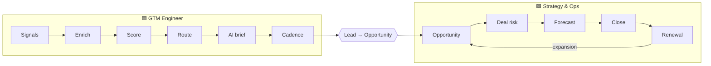

# Architecture

## The revenue lifecycle, split at one handoff



The handoff is lead conversion: the SQL becomes a stage-1 opportunity with `Originating_Lead__c` set. Everything before it is 🟦; everything after is 🟩. Field ownership is defined in the [object model](https://github.com/peytonbackus-spec/mitek-gtm-toolkit/blob/main/shared_core/data_model/salesforce-object-model.md).

## Systems

Salesforce is the hub and wins every conflict. Clay writes only to empty or `_clay` fields. Salesloft and Nooks log activity to Salesforce; Clari reads from Salesforce. AI output never writes to a CRM field without passing the human-review policy. Full map: [stack map](https://github.com/peytonbackus-spec/mitek-gtm-toolkit/blob/main/shared_core/context/gtm-stack-map.md).

Since Dec 2025, **Clari and Salesloft are one company**, so the 🟦 engagement layer and the 🟩 forecast layer share a vendor and a data layer. Activity-capture standards on one side directly affect forecast signals on the other.

## Code layout

```
config/mitek.yaml        every Mitek variable
shared_core/             config loader, DQ monitor, AI governance, metrics + SQL runner
gtm_engineer/            scoring, routing, lifecycle, AI research, funnel, capacity
gtm_strategy_ops/        pipeline, forecasting, deal risk, renewals, partner + Clari specs
scripts/                 synthetic data generator, wiki publisher
tests/                   unit tests, SQL/Python parity tests, prompt evals
```

## Data flow in the demo

`scripts/generate_sample_data.py` (seeded) → `sample_data/*.csv` → each script reads via `shared_core.config` → outputs to `outputs/` (git-ignored). SQL runs on an in-memory SQLite warehouse built from the same CSVs, with the semantic layer loaded first. In production the same code would read from a warehouse sync of Salesforce and Clari snapshots.
