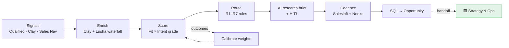

# 🟦 GTM Engineer Track

 

**Posting:** [GTM Engineer, Mitek Systems](https://jobs.lever.co/miteksystems-2/45e6c07b-c64d-4bc1-93dd-caf9e7b649ed). Owns *"the data, AI workflows, systems and operating processes that drive demand generation through qualified pipeline development."*

**Where this role sits:** everything from the first signal to an accepted opportunity. The handoff to the 🟩 Strategy & Ops track is lead conversion (see the [object model](../shared_core/data_model/salesforce-object-model.md)).



## Requirement → artifact map

| Posting requirement | Artifact | Type |
|---|---|---|
| Foundational analytics for lead-to-opp conversion | [`funnel_analytics/funnel_report.py`](funnel_analytics/funnel_report.py), [`sql/lead_funnel.sql`](funnel_analytics/sql/lead_funnel.sql) | ▶️ runnable |
| Dashboards: volume, velocity, pipeline value, account penetration | [`funnel_analytics/dashboard-spec.md`](funnel_analytics/dashboard-spec.md) | 📐 spec |
| Cohort and trend analysis on scoring and routing performance | [`lead_scoring/calibrate_scoring.py`](lead_scoring/calibrate_scoring.py), funnel cohorts | ▶️ runnable |
| Data-quality monitoring and reconciliation | [🟪 `dq_monitor.py`](../shared_core/data_quality/dq_monitor.py) (lead rules L01–L07, R01) | ▶️ shared |
| Early-pipeline outlooks and performance narratives | `funnel_report.early_pipeline_outlook()` + `narrative()` | ▶️ runnable |
| Production AI workflows for research, enrichment, qualification, routing | [`ai_research/account_research.py`](ai_research/account_research.py), [Clay waterfall](platform_admin/clay-enrichment-waterfall.md) | ▶️ + 📐 |
| Connect AI to GTM systems via low-code tools and APIs | Clay HTTP column → scoring; Flow → research API ([routing flow spec](lead_routing/salesforce-routing-flow-spec.md)) | 📐 spec |
| Prompts, outputs, evaluation criteria, HITL controls | [Prompt file](ai_research/prompts/account_research.md), [eval cases](ai_research/evals/account_research_cases.json), [🟪 HITL](../shared_core/ai_governance/hitl.py) | ▶️ tested in CI |
| Governance for data security and responsible AI | [🟪 AI workflow standard](../shared_core/ai_governance/README.md), [PII guard](../shared_core/ai_governance/pii_guard.py) | ▶️ shared |
| Measure realized gains in conversion, speed, capacity | [🟪 Impact metrics table](../shared_core/ai_governance/README.md#measuring-realized-gains) | 📐 spec |
| Own lead capture, enrichment, scoring, routing, disqualification | [Lifecycle spec](lead_lifecycle/lead-lifecycle-spec.md), [`score_leads.py`](lead_scoring/score_leads.py), [`route_leads.py`](lead_routing/route_leads.py) | ▶️ + 📐 |
| Translate GTM policies into Salesforce configurations | [Routing Flow spec](lead_routing/salesforce-routing-flow-spec.md), [🟪 object model](../shared_core/data_model/salesforce-object-model.md) | 📐 spec |
| Continuously improve scoring using conversion outcomes and fit signals | [`calibrate_scoring.py`](lead_scoring/calibrate_scoring.py) | ▶️ runnable |
| Qualification standards across Marketing, SDRs, AEs | [SQL qualification standard](lead_lifecycle/lead-lifecycle-spec.md#qualification-standard-for-sql-shared-by-marketing-sdr-and-ae) | 📐 spec |
| Administer Salesforce, Salesloft, Lusha, Clay, Nooks, Qualified, Sales Nav | [Clay + Lusha](platform_admin/clay-enrichment-waterfall.md), [Salesloft · Nooks · Qualified · Sales Nav](platform_admin/salesloft-nooks-qualified-salesnav.md) | 📐 spec |
| Operationalize ICP segmentation and target-account strategies | [🟪 ICP & personas](../shared_core/context/icp-and-personas.md), [`config/mitek.yaml`](../config/mitek.yaml) | 📐 + config |
| Partner with SDR leadership on capacity and performance | [`sdr_capacity/capacity_model.py`](sdr_capacity/capacity_model.py), [SLA monitor](lead_lifecycle/lifecycle_sla.py) | ▶️ runnable |
| Operational partner to Marketing, Sales, GTM Systems | [First 90 days](first-90-days.md) | 📐 plan |
| *Preferred:* SQL, BI, warehouse reporting | [`lead_funnel.sql`](funnel_analytics/sql/lead_funnel.sql) + [🟪 semantic layer](../shared_core/metrics/sql/semantic_layer.sql) | ▶️ runnable |
| *Preferred:* GTM application or agent development | AI research workflow + LLM client with live/mock modes | ▶️ runnable |

▶️ runs on the synthetic data in `sample_data/` · 📐 design spec / config

## Run it

```bash
python -m gtm_engineer.lead_scoring.score_leads          # grade every lead (A1–D4) + recommendation
python -m gtm_engineer.lead_scoring.calibrate_scoring    # does the score predict conversion? weight suggestions
python -m gtm_engineer.lead_routing.route_leads          # R1–R7 routing with reasons
python -m gtm_engineer.lead_lifecycle.lifecycle_sla      # MQL→SAL SLA by SDR and source; stuck leads
python -m gtm_engineer.ai_research.account_research      # AI briefs → HITL review queue
python -m gtm_engineer.funnel_analytics.funnel_report    # cohort funnel, velocity, penetration, outlook, narrative
python -m gtm_engineer.sdr_capacity.capacity_model       # headcount math from pipeline target
```
