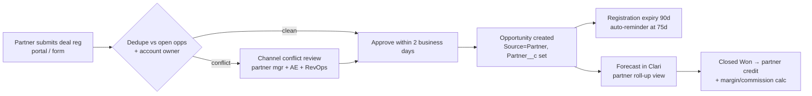

# Partner-Sourced Opportunity Workflow

> **Posting:** "Design renewal processes and partner-sourced opportunity workflows"

**Why this matters now at Mitek:** management has described Fiserv going live as a reseller, along with partnerships with Abrigo, CSI and Data Advisor, and growth in adjacent markets through channel partners. Community banks and credit unions mostly buy through their core or technology provider. Without a clean partner workflow, partner deals show up as AE-sourced, partner revenue is under-credited, and channel conflict goes unmanaged.

## Definitions

| Term | Definition | Field |
|---|---|---|
| **Partner-sourced** | The partner brought the opportunity (deal registration approved) | `Source__c = Partner` + `Partner__c` |
| **Partner-influenced** | Mitek sourced it; the partner materially helped (intro, integration, co-sell) | `Partner_Influence__c` (lookup) |
| **Resale** | The partner holds the paper (e.g. Fiserv reseller) | `Route_To_Market__c = Resale` |
| **Referral** | The partner refers; Mitek contracts directly | `Route_To_Market__c = Direct-Referral` |

## Flow

## Rules

1. **First valid registration wins** for 90 days. Extension needs proof of activity.
2. **Open-opportunity conflict:** if Mitek already has an open opportunity at stage 2 or later, the registration is rejected as partner-sourced but can be approved as partner-influenced.
3. **The 🟦 GTM Engineer's routing hands over here:** partner-referral leads route to the partner manager (rule R4 in [`route_leads.py`](../../gtm_engineer/lead_routing/route_leads.py)) and convert with `Partner__c` populated.
4. **Reporting:** partner-sourced pipeline, win rate and cycle get their own cut in the [pipeline report](../pipeline_analytics/pipeline_report.py) (the `source` dimension) and in Clari's partner roll-up.
5. **Data quality:** a partner-sourced opportunity with no partner named is flagged (DQ rule O07).

## Open questions for week one

- Does Fiserv resale run through Mitek's Salesforce, or does Fiserv report bookings after the fact?
- Is there a partner portal (PRM), or are registrations handled by email today?
- How are partner bookings counted against AE quota (full credit, split or overlay)?
