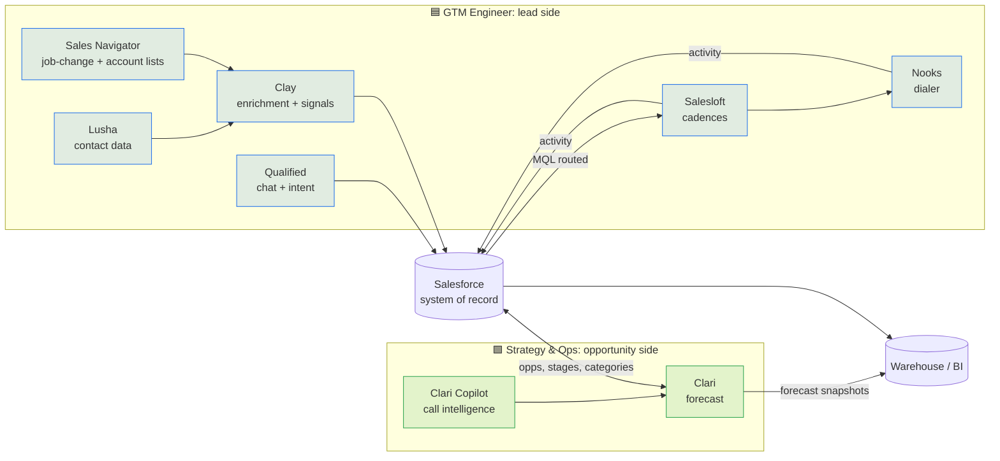

# Mitek GTM Stack Map

Every tool named across both postings, what it is the system of record for, and which role administers it. Salesforce is the hub. Nothing writes around it.

| Tool | System of record for | Primary admin | Named in posting |
|---|---|---|---|
| **Salesforce** | Leads, accounts, contacts, opportunities, activities | Shared: GTM Eng owns Lead and Campaign objects plus routing; Strategy & Ops owns Opportunity, forecast fields and renewals | Both |
| **Clari** | Forecast submissions, forecast categories, pipeline snapshots | 🟩 Strategy & Ops | Strategy & Ops |
| **Clari Copilot** | Call recordings and deal-level conversation signals | 🟩 Strategy & Ops | Strategy & Ops (preferred) |
| **Salesloft** | Cadences and email/call activity | 🟦 GTM Engineer | Both (Strategy & Ops as familiarity) |
| **Nooks** | Parallel dialing and call outcomes | 🟦 GTM Engineer | GTM Engineer |
| **Clay** | Enrichment waterfalls, signal detection, AI research columns | 🟦 GTM Engineer | GTM Engineer |
| **Lusha** | Contact emails and direct dials | 🟦 GTM Engineer | Both |
| **Qualified** | Website chat, intent, meeting booking | 🟦 GTM Engineer | GTM Engineer |
| **LinkedIn Sales Navigator** | Account and lead lists, job-change alerts | 🟦 GTM Engineer | Both |

## Integration rules

1. **Salesforce wins conflicts.** Clay writes only to fields with a `_clay` suffix or to empty fields, never over a rep-entered value. See the [object model](../data_model/salesforce-object-model.md).
2. **One owner per field.** Every custom field has an owning role in the object model. If a field has two writers, that's a bug to fix.
3. **Activity flows one way.** Salesloft and Nooks log to Salesforce. Clari reads from Salesforce. No tool reads activity from another tool directly.
4. **AI writes go through review.** No model output updates a CRM field without the [HITL policy](../ai_governance/hitl.py).
